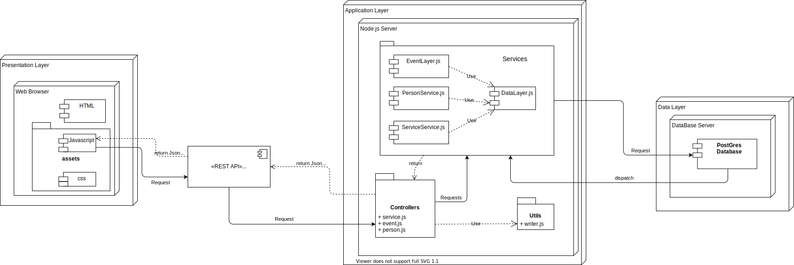
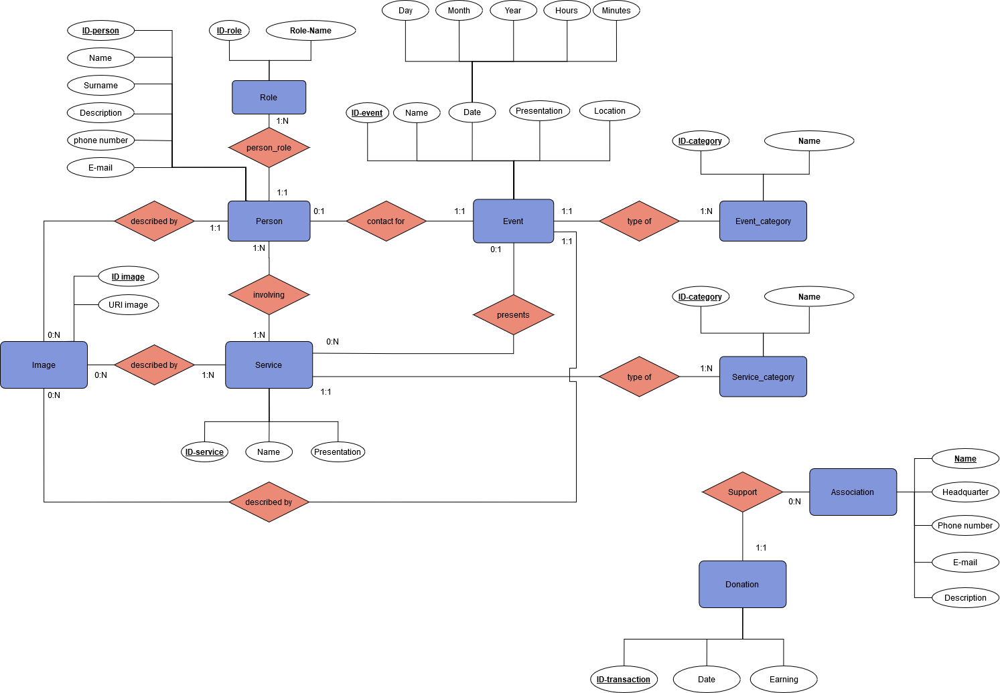

---
title: Documentation of the Backend part
...

## General group information
| Member n. | Role          | First name | Last Name | Matricola | Email address                     |
|-----------|---------------|------------|-----------|-----------|-----------------------------------|
| 1         | administrator | Alessio    | Fiorentino| 940488    | alessio.fiorentino@mail.polimi.it |
| 2         | member        | Chiara     | Barbera   | 920938    | chiara.barbera@mail.polimi.it     |

## Links to other deliverables
- Deliverable D0: the web application is accessible at [this
address](https://waipoua-association.herokuapp.com/).

- Deliverable D2: the YAML or JSON file containing the specification
of the app API can be found at [this
address](https://waipoua-association.herokuapp.com/backend/spec.yaml).

- Deliverable D3: the SwaggerUI page of the same API is available at
[this address](https://waipoua-association.herokuapp.com/backend/swaggerui).

- Deliverable D4: the source code of D0 is available as a zip file at
[this address](https://waipoua-association.herokuapp.com/backend/app.zip).

- Deliverable D5: the address of the online source control repository
is available [this address](https://github.com/Alexio96/Waipoua). We hereby
declare that this is a private repository and, upon request, we will
give access to the instructors.

## Specification

### Web Architecture

he HTML pages are not rendered on the server side since, like it's possible to see from the diagram, Javascript
code
handles the fetching of the resources.
Such data are picked up from the server side, through the REST API, and then they dynamically fill the HTML pages
with
respect to the specific page that does the request.
Moreover, each page manages its own dynamic content with its own javascript code.

### API

#### REST compliance

The architecture of the website uses a REST API that provides a **uniform interface** to the resources, since when they are required by the client, the latter are retrieved from database and exposed in the format required by the API. In this way, the client is not aware of how the resources are retrieved and it is independent from the server-side of the website.
Moreover, the connection is **stateless**, since in any case status information about the session are memorized. 
To increase the efficiency of the website, if necessary the resources retrieved by the website are stored locally (?? ASK ALESSIO) to avoid useless calls to the database.
Finally, we did not implement any authentication system since this requirement did not apply to our project: the architecture uses modular components that are highly coese and loosely coupled, so that they interact in a **layer structure**.

#### OpenAPI Resource models
The models of the resources are the following:

- **Event**: represents an event organized by the association. It is characterized by a unique *event_id* (integer), a **name** and a **presentation** (strings); moreover, it is characterized by a *date*, an *image*, a reference *contact* person, a *service* to which the event may be relative. Finally, the event is characterized by a *category*. These last 5 fields (date, image, contact, service, category) reference other models that will be described in the next lines.

- **Service**: a service provided by the association. It is characterized by a *service_id* (integer), a *name* and a *presentation* (strings). The service is characterized by a *category*, an array of *images*, an array of *events* in which the service is presented and an array of *people* involved in the service.
As above, category, images, events, and people refer to models that will be described in the next lines.

- **Person**: a person involved in the association. It is characterized by a *person_id* (integer), a *name*, a *surname*, an *email* a *phone_number* and a *description* (strings). Moreover, it contains a list of *services* in which the person is involved and a possible **event** for which the person can be the reference contact.

- **Image**: represents an image of a person, of an event or of a service. It is characterized by a simple *url* (string).

- **Category**: represents the category of service or event or the type of role. Even if these categories are well distinguished in the database, such a distrinction would be redundant in the API. The category contains a *category_id* (string) and a *name* (string).

- **Date**: a model for the date of the event. It has 5 integer fields, used to represent *day*, *month*, *year*, *hour*, *minutes*.

### Data model
We show here the ER diagram of our database. 

There is a 1:1 correspondance between the API models and the entities of services, events and people and images. The relationships are represented with references between the models of the API. The association and the donations, even if present in the database, are not access by the client and thus they are not represented in the API. Finally, the entities *role*, *service_category* and *event_category* are mapped to the model *category* in the API.

## Implementation
### Tools used
First, an OpenAPI has been developed on swagger.io and a  node-js server has been generated. Secondly,
the JavaScript language has been used to implement the data layer and the server. The front-end part has been
written in HTML and CSS with a common-used framework, i.e. Bootstrap.
 
### Discussion
Describe here:
- How did you make sure your web application adheres to the provided OpenAPI specification? Which method did you use to test all APIs endpoints against the expected response?

In order to verify that the web application adheres to the OpenAPI specifications, we accessed the endpoints through the browser and checked that the json data retrieved from the database respected the format required by the API.
(?? TUTORATO ?? CHIEDI se dobbiamo fare un test automatico.) 

- Our application adheres to REST common practices because there is both a set of static-assets (i.e. web pages
that do not require the access to the database) and a set of pages that require data from the database. In this case, they are retrieved through the data layer and (if necessary) cached, to reduce the number of calles made
to the database. 

- Since the website does not provide any login form, there is no need to manage the session of the user.
The website only retrieves information from the database and displays them in the pages.

- We used a relational database written in SQL and PostGres as DBMS. 

## Other information

### Task assignment

To be more efficient, we decided to split the work in the following way:

- Alessio worked on the front-end (50%), Data Layer development (40% of the time) and DataBase (10% of the time)

- Chiara worked on the front-end (40%), OpenAPI specification (30% of time) and DataBase (30% of the time)

Moreover, Alessio checked the code of Chiara and viceversa, to ensure a complete understanding of the code and a higher improvement of the acquired competences.

### Analysis of existing API

We did not search for existing APIs.

### Learning outcome

- Chiara wanted to learn more about the front-end development in HTML and CSS and acquired competences in Bootstrap usage. Moreover, she learned a lot about REST APIs and how they are implemented, as she was very curious of this topic of which she often heard about.

- Alessio approached the web development for the first time, so it's been an opportunity to learn
  to program languages like Javascript and markup ones (HTML, CSS and the Bootstrap library as well). Also,
  for him it's been really challenging, and interesting at the same time, the back-end development:
  how it's possible to exchange information between a client and server. Alessio studied REST API
  specifications which it's been essential to understand the behavior the website would have had.

